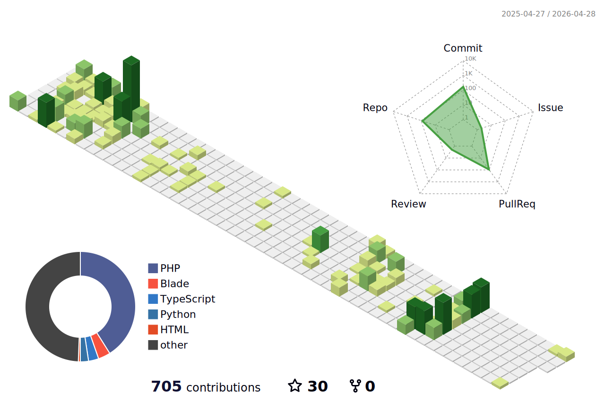

<h1 align="center" style="font-family: 'Montserrat', sans-serif; font-size: 3.5em; color: #00BFFF; text-shadow: 3px 3px 6px rgba(0,0,0,0.3); letter-spacing: 2px;">Arshia Mohammadei</h1>

  

  

  <strong>Code Alchemist</strong> | <strong>Cyber Guardian</strong> | <strong>Open-Source Visionary</strong>

  

---

## 🌌 Who Am I?
🧙‍♂️ **Code Wizard** – Transforming ideas into seamless solutions  
🔐 **Security Maestro** – Fortifying systems with ethical hacking  
🌍 **Open-Source Champion** – Advocating for a collaborative tech world  
🚀 **Lifelong Learner** – Driven by curiosity and innovation  

> *“Code is my canvas, challenges are my muse.”*

---

## 🔥 My Passions
- 💻 **Algorithms & Logic** – Solving puzzles with elegant code  
- 🛡️ **Cybersecurity** – Breaking to build stronger defenses  
- 🐧 **Linux & FOSS** – Embracing the power of open source  
- 📐 **Mathematics** – Finding beauty in logical patterns  
- 🎨 **Creative Ventures** – Igniting innovation with bold ideas  
- 🎵 **Music & Podcasts** – Coding to Jadi’s legendary insights  
- 🚴‍♂️ **Cycling & Cooking** – Fueling body and soul with passion  
- 👥 **Friends & Community** – The heart of every great project  

---

## 🌱 Current Adventures
- 🕵️‍♂️ Diving deep into **Advanced Ethical Hacking**  
- ⚡ Supercharging algorithms for **maximum performance**  
- 🌟 Exploring **cutting-edge tech** that sparks excitement  

---

## 🤝 Let’s Create Magic
🌟 Craving **ambitious, game-changing projects**  
💡 Got a vision? Let’s code it into reality!  
🛠 Need a problem tackled? I’m your tech ninja!  
📢 Love tech talks? Ping me for a chat!  

---

## 📬 Get in Touch

  
  

---

## 🎉 Quirky Facts
- 🐞 I charm bugs before banishing them  
- ⚡ My keyboard sings faster than my thoughts  
- 🍳 I whip up code as masterfully as meals  
- 🎧 Jadi’s podcasts are my coding superpower  

---

## 🔗 Inspiring Links
- 🌟 [Jadi’s GitHub](https://github.com/jadijadi) – A true tech icon  
- 🐧 [Linux.org](https://linux.org) – The soul of open source  

---

## 💥 Final Thoughts
> *“Stay curious, code relentlessly, and dream big.”*  
> *– Arshia Mohammadei*

---

  Crafted with ✨ by Arshia Mohammadei | Fueled by ☕ and Infinite Curiosity

